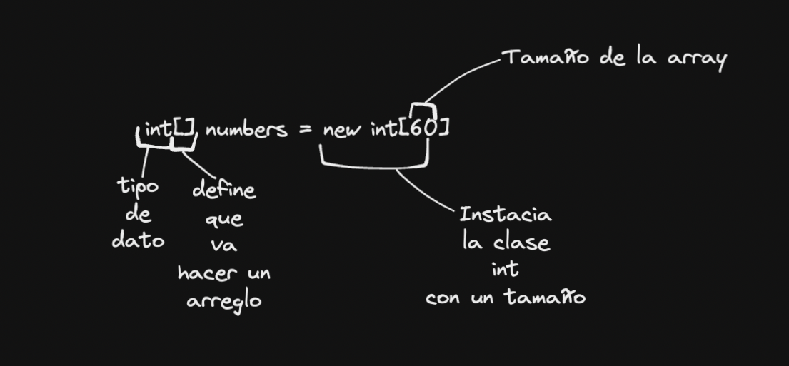
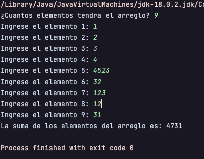
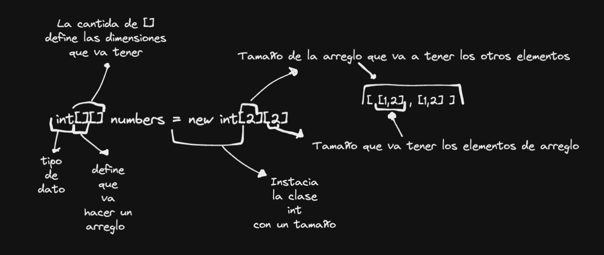
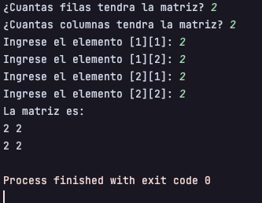

# Quiz 2 - Arrays

#### Tabla de contenidos
  - [¿Que es un Arreglo?](#que-es-un-arreglo-de-datos)
    - [¿Como se declara?](#como-se-declara-un-arreglo)
    - [Ejemplo](#ejemplo-de-un-arreglo)
  - [¿Que es un Arreglo Bidimensional o matriz?](#que-es-un-arreglo-bidimensional-o-matriz)
    - [¿Como se declara?](#como-se-declara-un-arreglo-bidimensional-o-matriz)
    - [Ejemplo](#ejemplo-de-un-arreglo-bidimensional-o-matriz)


## ¿Que es un Arreglo de Datos?

Un arreglo de datos o tambien llamado Array es una estructura de datos que almacena un conjunto de elementos de un mismo tipo. Los elementos pueden ser de cualquier tipo de dato, como enteros, caracteres, cadenas, etc. Los elementos de un arreglo se almacenan en posiciones consecutivas de memoria. El primer elemento del arreglo se almacena en la posición 0, el segundo elemento en la posición 1 y así sucesivamente. La posición del último elemento del arreglo se puede calcular como la longitud del arreglo menos 1.


## ¿Como se declara un Arreglo?

Para declarar un arreglo en Java se hace de la siguiente manera:

```java
tipo[] nombreArreglo = new tipo[tamaño];
```

Pero hay otras formas de declarar un arreglo, como por ejemplo:

```java
tipo nombreArreglo[]; // Se define sin tamaño
tipo[] nombreArreglo = new tipo[tamaño]; // Se define con tamaño pero sin valores
tipo[] nombreArreglo = {elemento1, elemento2, ..., elementoN}; // Se define con tamaño y valores
```



## Ejemplo de un Arreglo

En el siguiente ejemplo es la suma de todos los elementos de un arreglo, obtenidos por el usuario.

### Codigo

```java
import java.util.Scanner;

public class SumaArreglo {
    public static void main(String[] args) {
        Scanner entrada = new Scanner(System.in);
        int[] arreglo; // Se declara el arreglo
        int nElementos, suma = 0;

        System.out.print("¿Cuantos elementos tendra el arreglo? ");
        nElementos = entrada.nextInt();

        arreglo = new int[nElementos]; // Se crea el arreglo

        // Se llena el arreglo
        for (int i = 0; i < nElementos; i++) {
            System.out.print("Ingrese el elemento " + (i + 1) + ": ");
            arreglo[i] = entrada.nextInt();
            // Se suma cada elemento al total
            suma += arreglo[i];
        }

        System.out.println("La suma de los elementos del arreglo es: " + suma);
    }
}
```

### Salida



## ¿Que es un Arreglo Bidimensional o Matriz?

Un arreglo bidimensional o matriz es un arreglo de arreglos. Es decir, es un arreglo de elementos, cada uno de los cuales es un arreglo. Los elementos de un arreglo bidimensional se almacenan en posiciones consecutivas de memoria. El primer elemento del arreglo se almacena en la posición 0, el segundo elemento en la posición 1 y así sucesivamente. La posición del último elemento del arreglo se puede calcular como la longitud del arreglo menos 1.

### Manera visual de un arreglo bidimensional

El sigiente ejemplo muestra como se ve un arreglo bidimensional 5 x 2.

```bash
[ [0][0], [0][1], [0][2], [0][3], [0][4] ]
```

## ¿Como se declara un Arreglo Bidimensional o Matriz?

Para declarar un arreglo bidimensional en Java se hace de la siguiente manera:

```java
tipo[][] nombreArreglo = new tipo[fila][columna];
```

Pero hay otras formas de declarar un arreglo bidimensional, como por ejemplo:

```java
tipo nombreArreglo[][]; // Se define sin tamaño
tipo[][] nombreArreglo = new tipo[fila][columna]; // Se define con tamaño pero sin valores
tipo[][] nombreArreglo = {{elemento1, elemento2, ..., elementoN}, {elemento1, elemento2, ..., elementoN}}; // Se define con tamaño y valores
```



## Ejemplo de un Arreglo Bidimensional o Matriz

En el siguiente ejemplo es mostrar una matriz, obtenida por el usuario.

### Codigo

```java
import java.util.Scanner;

public class Matriz {
    public static void main(String[] args) {
        Scanner entrada = new Scanner(System.in);
        int[][] matriz; // Se declara la matriz
        int filas, columnas;

        System.out.print("¿Cuantas filas tendra la matriz? ");
        filas = entrada.nextInt();

        System.out.print("¿Cuantas columnas tendra la matriz? ");
        columnas = entrada.nextInt();

        matriz = new int[filas][columnas]; // Se crea la matriz

        // Se llena la matriz
        for (int i = 0; i < filas; i++) {
            for (int j = 0; j < columnas; j++) {
                System.out.print("Ingrese el elemento [" + (i + 1) + "][" + (j + 1) + "]: ");
                matriz[i][j] = entrada.nextInt();
            }
        }

        // Se muestra la matriz
        System.out.println("La matriz es: ");
        for (int i = 0; i < filas; i++) {
            for (int j = 0; j < columnas; j++) {
                System.out.print(matriz[i][j] + " ");
            }
            System.out.println();
        }
    }
}
```

### Salida



